# bedrock-unicode-characters
Minecraft: Bedrock Edition Unicode characters

## How to use
Copy the unicode character and paste it into Minecraft: Bedrock Edition chats, signs, titles etc.

## List of all characters

|               Name               |  Platform   | Character | Unicode | PHP 7.x  |                        In game                        |
|:--------------------------------:|:-----------:|:---------:|:-------:|:--------:|:-----------------------------------------------------:|
|             A Button             |    Xbox     |          | U+E000  | \u{E000} |                |
|             B Button             |    Xbox     |          | U+E001  | \u{E001} |               |
|             X Button             |    Xbox     |          | U+E002  | \u{E002} |                |
|             Y Button             |    Xbox     |          | U+E003  | \u{E003} |                  |
|            LB Button             |    Xbox     |          | U+E004  | \u{E004} |                     |
|            RB Button             |    Xbox     |          | U+E005  | \u{E005} |                    |
|            LT Button             |    Xbox     |          | U+E006  | \u{E006} |                    |
|            RT Button             |    Xbox     |          | U+E007  | \u{E007} |         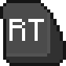          |
|          Select Button           |    Xbox     |          | U+E008  | \u{E008} |                          |
|           Start Button           |    Xbox     |          | U+E009  | \u{E009} |                           |
|        Left Stick Button         |    Xbox     |          | U+E00A  | \u{E00A} |                      |
|        Right Stick Button        |    Xbox     |          | U+E00B  | \u{E00B} |                     |
|         D-Pad Up Button          |    Xbox     |          | U+E00C  | \u{E00C} |                         |
|        D-Pad Left Button         |    Xbox     |          | U+E00D  | \u{E00D} |           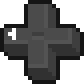            |
|        D-Pad Down Button         |    Xbox     |          | U+E00E  | \u{E00E} |                       |
|        D-Pad Right Button        |    Xbox     |          | U+E00F  | \u{E00F} |           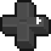           |
|           Tip A Button           |    Xbox     |          | U+E010  | \u{E010} |                 |
|           Tip B Button           |    Xbox     |          | U+E011  | \u{E011} |                |
|           Tip X Button           |    Xbox     |          | U+E012  | \u{E012} |                 |
|           Tip Y Button           |    Xbox     |          | U+E013  | \u{E013} |                   |
|           Cross Button           | PlayStation |          | U+E020  | \u{E020} |        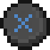         |
|          Circle Button           | PlayStation |          | U+E021  | \u{E021} |                |
|          Square Button           | PlayStation |          | U+E022  | \u{E022} |                 |
|         Triangle Button          | PlayStation |          | U+E023  | \u{E023} |                   |
|            L1 Button             | PlayStation |          | U+E024  | \u{E024} |                      |
|            R1 Button             | PlayStation |          | U+E025  | \u{E025} |                     |
|            L2 Button             | PlayStation |          | U+E026  | \u{E026} |                     |
|            R2 Button             | PlayStation |          | U+E027  | \u{E027} |          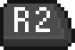          |
|          Select Button           | PlayStation |          | U+E028  | \u{E028} |             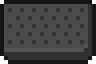              |
|           Start Button           | PlayStation |          | U+E029  | \u{E029} |                            |
|        Left Stick Button         | PlayStation |          | U+E02A  | \u{E02A} |                       |
|        Right Stick Button        | PlayStation |          | U+E02B  | \u{E02B} |                      |
|         D-Pad Up Button          | PlayStation |          | U+E02C  | \u{E02C} |                          |
|        D-Pad Left Button         | PlayStation |          | U+E02D  | \u{E02D} |                        |
|        D-Pad Down Button         | PlayStation |          | U+E02E  | \u{E02E} |                        |
|        D-Pad Right Button        | PlayStation |          | U+E02F  | \u{E02F} |                       |
|             A Button             |  Nintendo   |          | U+E040  | \u{E040} |              |
|             B Button             |  Nintendo   |          | U+E041  | \u{E041} |             |
|             X Button             |  Nintendo   |          | U+E042  | \u{E042} |              |
|             Y Button             |  Nintendo   |          | U+E043  | \u{E043} |                |
|             L Button             |  Nintendo   |          | U+E044  | \u{E044} |                   |
|             R Button             |  Nintendo   |          | U+E045  | \u{E045} |                  |
|            ZL Button             |  Nintendo   |          | U+E046  | \u{E046} |                  |
|            ZR Button             |  Nintendo   |          | U+E047  | \u{E047} |                 |
|             - Button             |  Nintendo   |          | U+E048  | \u{E048} |                        |
|             + Button             |  Nintendo   |          | U+E049  | \u{E049} |                         |
|        Left Stick Button         |  Nintendo   |          | U+E04A  | \u{E04A} |                    |
|        Right Stick Button        |  Nintendo   |          | U+E04B  | \u{E04B} |                   |
|         D-Pad Up Button          |  Nintendo   |          | U+E04C  | \u{E04C} |                       |
|        D-Pad Left Button         |  Nintendo   |          | U+E04D  | \u{E04D} |          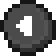           |
|        D-Pad Down Button         |  Nintendo   |          | U+E04E  | \u{E04E} |                     |
|        D-Pad Right Button        |  Nintendo   |          | U+E04F  | \u{E04F} |                    |
|        Left Mouse Button         |   Windows   |          | U+E060  | \u{E060} |                    |
|        Right Mouse Button        |   Windows   |          | U+E061  | \u{E061} |                   |
|       Middle Mouse Button        |   Windows   |          | U+E062  | \u{E062} |                  |
|           Mouse Button           |   Windows   |          | U+E063  | \u{E063} |                         |
|     Tip Touch Foward Button      |   Mobile    |          | U+E065  | \u{E065} |                    |
|      Tip Touch Left Button       |   Mobile    |          | U+E066  | \u{E066} |                       |
|      Tip Touch Back Button       |   Mobile    |          | U+E067  | \u{E067} |           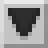            |
|      Tip Touch Right Button      |   Mobile    |          | U+E068  | \u{E068} |                      |
|      Tip Touch Jump Button       |   Mobile    |          | U+E069  | \u{E069} |                       |
|      Tip Touch Sneak Button      |   Mobile    |          | U+E06A  | \u{E06A} |                      |
|    Tip Touch Inventory Button    |   Mobile    |          | U+E06B  | \u{E06B} |                  |
|     Tip Touch Fly Up Button      |   Mobile    |          | U+E06C  | \u{E06C} |          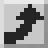           |
|       Tip Fly Down Button        |   Mobile    |          | U+E06D  | \u{E06D} |                   |
|         Tip Left Trigger         |   Mobile    |          | U+E06E  | \u{E06E} |                     |
|        Tip Right Trigger         |   Mobile    |          | U+E06F  | \u{E06F} |                    |
|     Light Mouse Left Button      |   Windows   |          | U+E070  | \u{E070} |              |
|     Light Mouse Right Button     |   Windows   |          | U+E071  | \u{E071} |             |
|    Light Mouse Middle Button     |   Windows   |          | U+E072  | \u{E072} |            |
|        Light Mouse Button        |   Windows   |          | U+E073  | \u{E073} |                   |
|          Tip Left Stick          |   Mobile    |          | U+E075  | \u{E075} |                       |
|         Tip Right Stick          |   Mobile    |          | U+E076  | \u{E076} |                      |
|       Foward Arrow Button        |   Mobile    |          | U+E080  | \u{E080} |                        |
|        Left Arrow Button         |   Mobile    |          | U+E081  | \u{E081} |                           |
|      Backwards Arrow Button      |   Mobile    |          | U+E082  | \u{E082} |                           |
|        Right Arrow Button        |   Mobile    |          | U+E083  | \u{E083} |                          |
|           Jump Button            |   Mobile    |          | U+E084  | \u{E084} |                           |
|          Crouch Button           |   Mobile    |          | U+E085  | \u{E085} |                          |
|          Fly Up Button           |   Mobile    |          | U+E086  | \u{E086} |                         |
|         Fly Down Button          |   Mobile    |          | U+E087  | \u{E087} |                       |
|       Craftable Toggle On        |     All     |          | U+E0A0  | \u{E0A0} |                  |
|       Craftable Toggle Off       |     All     |          | U+E0A1  | \u{E0A1} |                 |
|              Shank               |     All     |          | U+E100  | \u{E100} |                                |
|              Armor               |     All     |          | U+E101  | \u{E101} |                                |
|             Minecoin             |     All     |          | U+E102  | \u{E102} |                             |
|       Code Builder Button        |     All     |          | U+E103  | \u{E103} |                  |
|     Immersive Reader Button      |     All     |          | U+E104  | \u{E104} |              |
|              Token               |     All     |          | U+E105  | \u{E105} |                                |
|         Left Grab Button         | Windows MR  |          | U+E0C0  | \u{E0C0} |                  |
|        Right Grab Button         | Windows MR  |          | U+E0C1  | \u{E0C1} |                 |
|           Menu Button            | Windows MR  |          | U+E0C2  | \u{E0C2} |                       |
|        Left Stick Button         | Windows MR  |          | U+E0C3  | \u{E0C3} |                 |
|        Right Stick Button        | Windows MR  |          | U+E0C4  | \u{E0C4} |                |
|       Left Touchpad Button       | Windows MR  |          | U+E0C5  | \u{E0C5} |              |
| Left Touchpad Horizontal Button  | Windows MR  |          | U+E0C6  | \u{E0C6} | 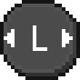  |
|  Left Touchpad Vertical Button   | Windows MR  |          | U+E0C7  | \u{E0C7} |     |
|      Right Touchpad Button       | Windows MR  |          | U+E0C8  | \u{E0C8} |             |
| Right Touchpad Horizontal Button | Windows MR  |          | U+E0C9  | \u{E0C9} |  |
|  Right Touchpad Vertical Button  | Windows MR  |          | U+E0CA  | \u{EOCA} |    |
|       Left Trigger Button        | Windows MR  |          | U+E0CB  | \u{E0CB} |               |
|       Right Trigger Button       | Windows MR  |          | U+E0CC  | \u{E0CC} |              |
|             Windows              | Windows MR  |          | U+E0CD  | \u{E0CD} |                    |
|             0 Button             |    Rift     |          | U+E0E0  | \u{E0E0} |               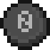                |
|             A Button             |    Rift     |          | U+E0E1  | \u{E0E1} |                               |
|             B Button             |    Rift     |          | U+E0E2  | \u{E0E2} |                               |
|         Left Grab Button         |    Rift     |          | U+E0E3  | \u{E0E3} |                         |
|        Right Grab Button         |    Rift     |          | U+E0E4  | \u{E0E4} |                        |
|        Left Stick Button         |    Rift     |          | U+E0E5  | \u{E0E5} |           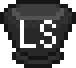           |
|        Right Stick Button        |    Rift     |          | U+E0E6  | \u{E0E6} |          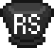           |
|       Left Trigger Button        |    Rift     |          | U+E0E7  | \u{E0E7} |          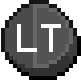          |
|       Right Trigger Button       |    Rift     |          | U+E0E8  | \u{E0E8} |         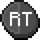          |
|             X Button             |    Rift     |          | U+E0E9  | \u{E0E9} |                               |
|             Y Button             |    Rift     |          | U+E0EA  | \u{E0EA} |                               |